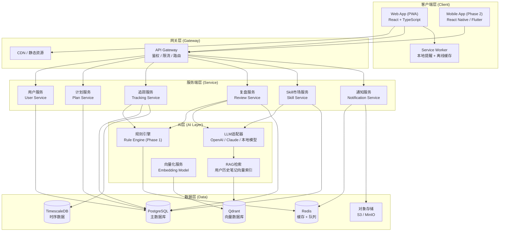
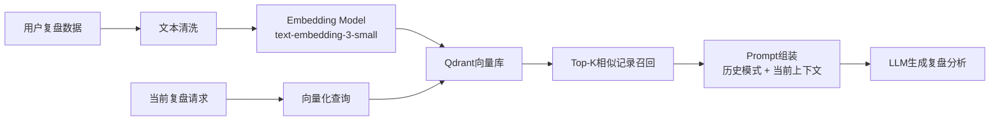
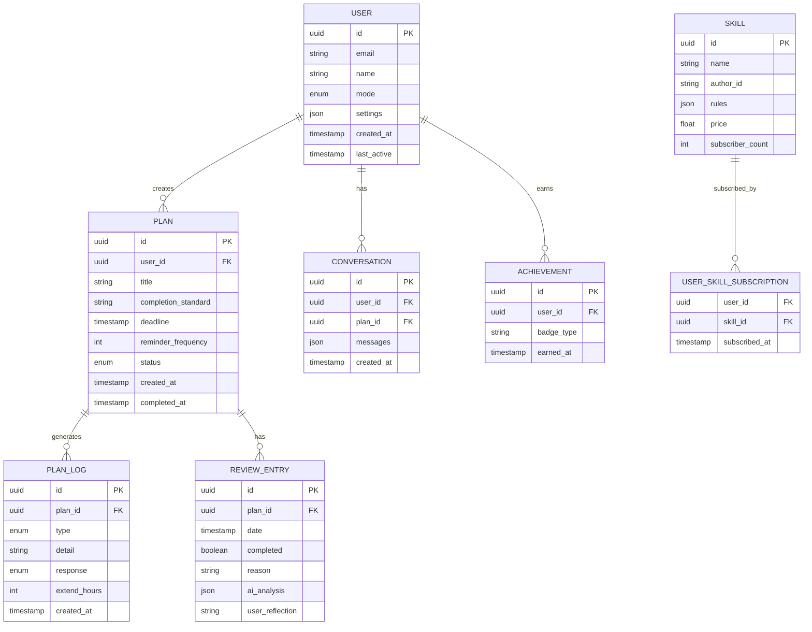
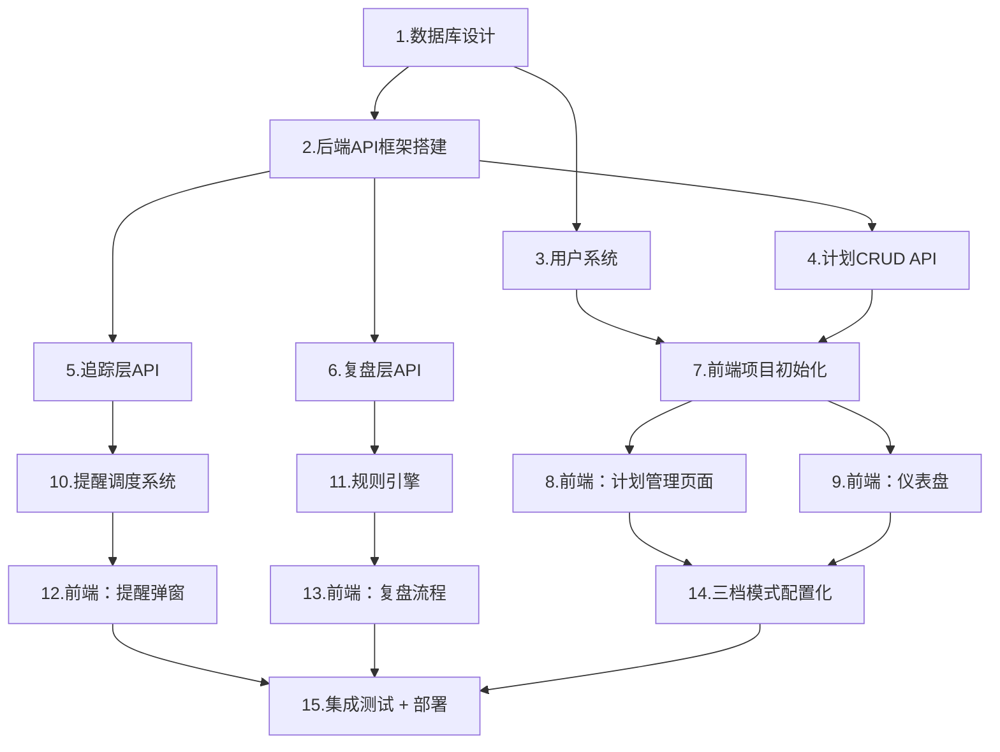

# 严师APP — 系统化架构设计方案

> 基于产品方案PDF（v1.0, 2026-06-28），按PRD补全 → 系统架构 → 开发路线 → Agent执行清单四步流程输出。

---

## 第一步：PRD补全与澄清

### 1.1 文档原文功能点提取

| 序号 | 模块 | 原文功能点 |
|------|------|-----------|
| 1 | 产品定位 | AI执行监督系统；"写计划 = 立军令状" |
| 2 | 品牌哲学 | 基于Karpathy AI导师理念，从"学"延伸到"执行" |
| 3 | 三档模式 | 时刻提醒型 / 适当建议型 / 方法交流型，注册时选定 |
| 4 | 承诺层 | 录入计划：目标、完成标准、截止时间、提醒频率 |
| 5 | 追踪层 | 按档位触发不同频率提醒；未完成追问原因；记录中断模式 |
| 6 | 复盘层 | 日/周/月强制复盘；AI分析中断规律；AI追问到底 |
| 7 | 自动调档 | AI根据行为主动建议切换模式（如连续3天未完成提示加强提醒） |
| 8 | 创作者生态 | Phase 2 Skill市场：不同严师风格 x 不同方法论 = skill商品 |
| 9 | 商业模式 | 会员订阅 + Skill市场抽成 + 企业版 |
| 10 | 定价 | 基础版免费（1计划+标准督促）；Pro ¥19.9/月；企业版 ¥49.9/人/月 |
| 11 | 竞品 | 滴答清单、Forest、Habitica、各种AI助手 |
| 12 | 冷启动策略 | Phase 1用模板+规则引擎，数据积累后再上个性化AI |

### 1.2 缺失、模糊与矛盾识别

| 问题类别 | 具体描述 | 严重程度 |
|----------|----------|----------|
| **用户场景缺失** | 未定义首次使用流程（onboarding）、计划编辑/删除、历史记录查看 | 高 |
| **交互逻辑不完整** | "追问不能被一键关掉"的具体交互未定义；复盘"强制"如何体现（弹窗？锁屏？） | 高 |
| **技术约束未说明** | 未明确移动端优先还是Web优先；推送依赖APNs/FCM还是仅应用内 | 中 |
| **数据模型缺失** | 未定义计划、用户、复盘记录、日志等核心实体的结构和关系 | 高 |
| **AI实现路径模糊** | "初期用模板+规则引擎"但未定义规则语法、触发条件、话术模板结构 | 中 |
| **商业模式矛盾** | Phase 2才做Skill市场，但定价章节已列出Skill抽成20-30%，时间线不一致 | 低 |
| **数据接入未定义** | "接日历/屏幕时间等数据"未说明哪些平台、权限模型、隐私合规 | 中 |
| **多端同步缺失** | 未提及是否支持多设备同步，离线场景如何处理 | 中 |

### 1.3 推演补充（标注 `[推演]`）

#### 用户系统 `[推演]`

原文未定义用户账户体系。基于督促类App的行业实践，用户系统至少包含：
- 匿名快速体验（降低冷启动门槛）+ 可选手机号/邮箱注册
- 用户画像：选定的模式、历史完成率、偏好设置（免打扰时段、提醒音效）
- 成就系统：连续完成天数、总完成计划数、等级徽章（参考Habitica的游戏化思路）

#### 计划生命周期 `[推演]`

原文定义了创建但未定义编辑、暂停、归档：
- 计划状态机：`draft` → `active` → `completed` / `abandoned` / `overdue` → `archived`
- 支持暂停（pause）功能：用户可临时暂停某个计划，暂停期间不触发提醒
- 计划模板库：内置常见计划模板（健身、学习、写作等），降低创建门槛

#### 追问交互设计 `[推演]`

原文提到"追问不能被一键关掉"，具体推演：
- **时刻提醒型**：推送必须滑动/点击回应才能消失；首次提醒后1小时未回应自动升级；支持"再给1小时"（单次延期，最多3次）或"今天放弃"（触发复盘）
- **适当建议型**：推送可忽略，但2小时后再次提醒；最多提醒2次
- **方法交流型**：仅推送一次策略建议卡片，不反复打扰

#### 复盘强制机制 `[推演]`

原文说"强制复盘"但未定义如何强制：
- 到复盘时间点，打开App时首先弹出复盘弹窗，必须填写后才能进入其他功能
- 推送深度链接直达复盘页面
- 未完成复盘的计划次日自动标记为"未复盘"，影响连续完成统计

#### 数据接入策略 `[推演]`

"接日历/屏幕时间"具体化：
- V1仅支持手动填写复盘原因，不接外部数据（降低合规风险）
- V2可选接入Apple Screen Time / Android Digital Wellbeing（需用户主动授权）
- 日历接入仅读取事件标题/时间段，不读取详情内容

#### 多端与离线 `[推演]`

原文未提及：
- MVP采用**PWA/Web优先**策略（开发效率高，跨平台），Phase 2补Native App
- 核心数据本地缓存（IndexedDB），网络恢复后异步同步
- 提醒依赖Service Worker（Web）或本地通知API

---

## 第二步：系统架构设计

### 2.1 整体架构图

### 2.2 核心模块设计

#### 模块一：计划管理（Plan Service）

| 职责 | 关键接口 | 说明 |
|------|----------|------|
| 计划CRUD | `POST /plans`, `GET /plans`, `PUT /plans/:id`, `DELETE /plans/:id` | 支持草稿、激活、完成、放弃、归档状态流转 |
| 计划模板 | `GET /plan-templates` | 内置模板库，降低首次创建门槛 |
| 批量操作 | `POST /plans/batch-archive` | 支持批量归档过期计划 |
| 完成标准校验 | `POST /plans/:id/validate` | 校验完成标准是否可量化 `[推演]` |

#### 模块二：AI追踪引擎（Tracking Service + AI Layer）

| 职责 | 关键组件 | 说明 |
|------|----------|------|
| 提醒调度 | Reminder Scheduler | 基于用户模式和计划截止时间计算提醒时间点 |
| 规则引擎 | Rule Engine | Phase 1核心，基于配置文件驱动的话术和逻辑 |
| 追问逻辑 | Follow-up Engine | 根据用户回应（完成/延期/放弃）触发不同分支 |
| 超时升级 | Escalation Engine | 多级提醒递进（1h → 3h → 6h） |

#### 模块三：复盘分析（Review Service + AI Layer）

| 职责 | 关键组件 | 说明 |
|------|----------|------|
| 复盘触发 | Review Trigger | 按模式频率（每日/每周）强制触发 |
| 规则分析 | Pattern Analyzer | 基于规则统计连续完成/未完成次数、中断原因分布 |
| LLM分析 | LLM Review Analyzer | Phase 2接入，生成个性化复盘报告 |
| 调档建议 | Mode Advisor | 根据行为数据推荐模式切换 |

#### 模块四：Skill市场（Skill Service）

| 职责 | 关键接口 | 说明 |
|------|----------|------|
| Skill注册 | `POST /skills` | 创作者上传自定义规则包 |
| Skill订阅 | `POST /skills/:id/subscribe` | 用户订阅/取消Skill |
| 规则注入 | Rule Injection | 订阅的Skill规则动态注入规则引擎 |
| 收益结算 | Revenue Settlement | 平台抽成结算 `[推演]` |

#### 模块五：用户系统（User Service）

| 职责 | 关键接口 | 说明 |
|------|----------|------|
| 认证 | `POST /auth/login`, `POST /auth/register` | JWT Token，支持匿名体验 `[推演]` |
| 用户画像 | `GET /users/:id/profile` | 模式偏好、完成率统计、成就徽章 `[推演]` |
| 设置 | `PUT /users/:id/settings` | 免打扰时段、提醒音效、主题 `[推演]` |
| 成就 | Achievement Engine | 连续完成、总计划数等徽章系统 `[推演]` |

#### 模块六：通知服务（Notification Service）

| 职责 | 通道 | 说明 |
|------|------|------|
| 应用内通知 | In-app Toast / Modal | 实时弹窗，无需依赖外部推送 |
| Web推送 | Web Push API + Service Worker | PWA离线提醒 `[推演]` |
| 移动端推送 | APNs / FCM | Phase 2 Native App接入 `[推演]` |
| 邮件提醒 | SMTP | 长时间未登录用户的召回 `[推演]` |

### 2.3 AI能力集成

#### LLM调用策略

| 维度 | Phase 1（规则引擎） | Phase 2（LLM增强） |
|------|---------------------|-------------------|
| **提醒话术** | 固定模板 + 变量插值 | LLM根据上下文生成个性化话术 |
| **复盘分析** | 规则统计 + 预设建议 | LLM分析中断模式，生成自然语言报告 |
| **追问逻辑** | 规则分支（时间不够→追问A，难度太大→追问B） | LLM多轮对话式追问 |
| **上下文管理** | 无状态，每次独立 | 维护7天对话上下文窗口 |
| **流式响应** | 不适用（规则引擎即时返回） | SSE流式输出复盘报告 |

**上下文管理设计 `[推演]`：**
- 每条计划独立维护一个对话会话（Conversation）
- 上下文窗口：最近7天的用户-AI交互记录
- 超过窗口的历史记录通过RAG检索注入Prompt

#### RAG设计（Phase 2+）

| 组件 | 选型 | 理由 |
|------|------|------|
| Embedding模型 | OpenAI text-embedding-3-small | 成本低、中文效果好、1536维 |
| 向量数据库 | Qdrant | 开源、Rust高性能、支持过滤查询、部署简单 |
| 文本切片 | 按"计划-日期"粒度整段入库 | 保持语义完整性，避免过度切片 |
| 元数据过滤 | user_id + plan_id | 确保只检索用户自己的历史数据 |

### 2.4 数据模型

### 2.5 技术栈建议

#### 推荐方案

| 层级 | 技术选型 | 理由 |
|------|----------|------|
| **前端** | React 18 + TypeScript + Vite + Tailwind CSS | 生态成熟、Agent实现友好、PWA支持完善 |
| **状态管理** | Zustand + Immer | 轻量、TypeScript友好、Slice模式便于扩展 |
| **后端框架** | FastAPI (Python) | 异步原生、自动生成OpenAPI文档、LLM生态（LangChain等）集成最佳 |
| **数据库** | PostgreSQL 15 + TimescaleDB插件 | 关系数据+时序数据一体，减少技术栈复杂度 |
| **缓存/队列** | Redis | 提醒任务队列、会话缓存、限流 |
| **向量库** | Qdrant | 开源、高性能、支持Docker一键部署 |
| **LLM调用** | LiteLLM Proxy | 统一多供应商接口（OpenAI/Claude/本地），便于切换和Fallback |
| **部署** | Docker Compose (MVP) → Kubernetes (Scale) | MVP阶段容器化足够，避免过度运维 |
| **监控** | Prometheus + Grafana | 开源标准方案，社区文档丰富 |

#### 备选方案对比

| 维度 | 推荐方案 | 备选A (Node.js全栈) | 备选B (Go后端) | 决策 |
|------|----------|---------------------|----------------|------|
| **后端语言** | Python/FastAPI | Node.js/NestJS | Go/Gin | Python LLM生态最强，Agent易实现 |
| **开发效率** | 高 | 高 | 中 | Node.js与前端同栈，但LLM库不如Python |
| **运行时性能** | 中 | 中 | 高 | Go性能最好，但LLM集成开发成本更高 |
| **维护成本** | 低 | 低 | 中 | Python/FastAPI文档丰富，社区活跃 |
| **Agent可执行性** | 最高 | 高 | 中 | Python是LLM Agent事实标准语言 |

---

## 第三步：开发路线图

### Phase 1 — MVP：核心闭环（4-5周）

**目标**：让用户能完整走通"创建计划 → 收到提醒 → 完成/放弃 → 复盘"的最小闭环。

| 功能清单 | 技术任务 | 验收标准 | 工时（人天） | 阻塞风险 |
|----------|----------|----------|-------------|----------|
| 用户注册/登录 | JWT鉴权 + 匿名体验 | 匿名用户可创建计划，注册后数据迁移 | 2 | 低 |
| 计划CRUD | 数据库设计 + REST API + 前端表单 | 可创建、编辑、删除计划；完成标准拒绝模糊输入 | 3 | 低 |
| 三档模式选择 | 模式配置化 + 用户偏好存储 | 注册时可选择模式，设置页面可切换 | 2 | 低 |
| 追踪层：提醒调度 | 定时任务 + 推送通知 | 按模式频率触发提醒；Service Worker离线提醒 | 4 | **中** `[技术债]` |
| 追踪层：追问弹窗 | 多层级弹窗交互 | 时刻提醒型弹窗不可一键关闭；支持"再给1小时"/"放弃" | 3 | 低 |
| 复盘层：强制复盘 | 复盘表单 + 原因选择 | 到点弹出复盘；未完成必填原因 | 2 | 低 |
| 复盘层：规则分析 | 规则引擎 + 统计分析 | 连续完成/未完成计数；预设建议输出 | 3 | 低 |
| 仪表盘 | 统计卡片 + 计划列表 | 总计划/进行中/已完成/已放弃统计 | 2 | 低 |
| 部署 | Docker Compose + Nginx | 可公网访问；HTTPS | 2 | 低 |

**Phase 1 工时合计：约 23 人天**（1人全职约5周）

**[技术债] Phase 1 已知债务：**

| 债务项 | 影响 | 偿还计划 |
|--------|------|----------|
| 提醒调度用简单setInterval/定时任务 | 高并发下提醒延迟不准 | Phase 2迁移至Redis队列 + Celery Beat |
| 规则引擎硬编码在代码中 | 新增规则需发版 | Phase 2支持规则热更新/数据库存储 |
| 无用户数据加密 | 隐私合规风险 | Phase 2接入字段级加密 |
| PWA推送兼容性问题 | iOS Safari支持有限 | Phase 2评估是否需要补Native App |

---

### Phase 2 — 增强：AI深化 + Skill市场（6-8周）

**目标**：接入LLM实现个性化复盘，上线Skill市场创作者生态。

| 功能清单 | 技术任务 | 验收标准 | 工时（人天） | 阻塞风险 |
|----------|----------|----------|-------------|----------|
| LLM接入 | LiteLLM Proxy + SSE流式响应 | 复盘报告由LLM生成；支持多供应商切换 | 4 | 中 |
| 多轮对话上下文 | Conversation表 + 上下文窗口管理 | 复盘支持追问；上下文保留7天 | 3 | 低 |
| 笔记内AI续写/润色 | 计划编辑器接入LLM | 选中文字可让AI续写或润色完成标准 | 3 | 低 |
| 本地缓存 + 离线优先 | IndexedDB + Service Worker同步策略 | 断网可查看计划和历史；恢复后自动同步 | 4 | **中** |
| Skill市场：创作者端 | Skill上传 + 规则包格式定义 | 创作者可上传规则JSON；平台审核后上架 | 5 | **高** `[技术债]` |
| Skill市场：用户端 | Skill浏览 + 订阅 + 规则注入 | 用户可订阅Skill；规则动态生效 | 3 | 中 |
| 支付系统 | Stripe/支付宝集成 | Pro会员可付费订阅；Skill购买可结算 | 4 | **高** |
| 数据看板 | 完成率趋势图 + 中断原因分布 | 可视化统计；支持导出 | 3 | 低 |

**Phase 2 工时合计：约 29 人天**（1人全职约7周）

**[技术债] Phase 2 新增债务：**

| 债务项 | 影响 | 偿还计划 |
|--------|------|----------|
| Skill规则沙箱未实现 | 恶意规则可能影响系统稳定 | Phase 3引入WebAssembly沙箱执行环境 |
| 支付系统仅支持单一渠道 | 覆盖用户有限 | Phase 3接入更多支付渠道 |

---

### Phase 3 — 进阶：RAG + 多设备同步 + 企业版（8-10周）

**目标**：RAG检索历史笔记、多端实时同步、企业版SaaS。

| 功能清单 | 技术任务 | 验收标准 | 工时（人天） | 阻塞风险 |
|----------|----------|----------|-------------|----------|
| RAG：笔记向量化 | Embedding Pipeline + Qdrant接入 | 复盘时自动检索用户历史相似记录 | 5 | 中 |
| RAG：检索增强生成 | 向量检索 + Prompt组装 | LLM复盘引用用户历史数据做个性化分析 | 4 | 中 |
| 多设备实时同步 | WebSocket + OT/CRDT | 多端同时编辑计划无冲突；状态实时同步 | 6 | **高** |
| 离线优先架构重构 | Service Worker缓存策略升级 | 完全离线可用；同步冲突自动解决 | 5 | **高** |
| 企业版：团队管理 | 组织/成员/角色权限 | 管理员可创建团队；邀请成员；分配计划 | 4 | 中 |
| 企业版：管理看板 | 团队完成率统计 + 导出 | 管理者查看团队整体执行情况 | 3 | 低 |
| 企业版：SSO/SAML | 企业身份认证集成 | 支持企业微信/钉钉/飞书SSO登录 | 4 | **高** |
| 合规：GDPR/数据导出 | 数据删除/导出API | 用户可一键导出全部数据；删除后30天内物理清除 | 3 | 中 |

**Phase 3 工时合计：约 34 人天**（1人全职约8周）

---

## 第四步：Agent执行清单

### 任务依赖关系图

> **并行组说明**：
> - **可并行**：T1~T3（基础设施）、T4~T6（业务API）、T8~T9（前端页面）
> - **必须串行**：T7依赖T2/T3/T4；T12依赖T10；T13依赖T11；T15依赖所有前置任务

---

### 详细任务清单

#### Phase 1 任务

- [ ] **T1：数据库设计与初始化**
  - 输入依赖：无
  - 输出产物：`schema.sql`（User/Plan/PlanLog/ReviewEntry/Conversation表）
  - 验收标准：所有表可正常创建；外键约束正确；TimescaleDB hypertable配置完成
  - 人工决策点：是否需要支持软删除（`deleted_at`字段）？`[建议：支持，便于数据恢复]`

- [ ] **T2：后端API框架搭建**
  - 输入依赖：无
  - 输出产物：FastAPI项目骨架 + Docker Compose配置
  - 验收标准：`docker-compose up`一键启动；健康检查端点可访问；OpenAPI文档自动生成
  - 技术债标记：`[技术债]` 初期用SQLite方便开发，Phase 1结束前切换至PostgreSQL

- [ ] **T3：用户系统（注册/登录/匿名体验）**
  - 输入依赖：T2
  - 输出产物：User Service + JWT鉴权中间件
  - 验收标准：匿名用户可创建计划；注册后数据自动关联；Token过期机制正确
  - 人工决策点：匿名用户数据保留策略（30天后自动清理？）`[建议：保留30天，清理前邮件提醒]`

- [ ] **T4：计划CRUD API**
  - 输入依赖：T1, T2
  - 输出产物：Plan Service（REST API + 状态机逻辑）
  - 验收标准：CRUD接口全部通过Postman测试；状态流转正确（draft→active→completed/abandoned）；完成标准拒绝模糊输入（关键词检测："我要"、"尽量"等）

- [ ] **T5：追踪层API**
  - 输入依赖：T2, T4
  - 输出产物：Tracking Service（提醒调度 + 日志记录）
  - 验收标准：计划创建后自动生成提醒任务；用户回应后正确记录日志；支持"再给1小时"延期逻辑

- [ ] **T6：复盘层API**
  - 输入依赖：T2, T4
  - 输出产物：Review Service（复盘表单 + 规则分析）
  - 验收标准：复盘记录可创建/查询；连续完成/未完成计数正确；规则匹配输出预设建议

- [ ] **T7：前端项目初始化**
  - 输入依赖：无（可与后端并行）
  - 输出产物：React + Vite + Tailwind + Zustand项目骨架
  - 验收标准：`npm run dev`正常启动；路由配置完成；暗黑主题CSS变量定义完成
  - 人工决策点：是否支持Markdown编辑？`[建议：Phase 1用纯文本，Phase 2接入富文本编辑器]`

- [ ] **T8：前端 — 计划管理页面**
  - 输入依赖：T7, T4（API就绪后联调）
  - 输出产物：计划列表 + 创建/编辑表单 + 详情页
  - 验收标准：表单验证完整；创建后自动刷新列表；编辑/删除功能可用

- [ ] **T9：前端 — 仪表盘**
  - 输入依赖：T7
  - 输出产物：统计卡片 + 活跃计划列表 + 历史记录
  - 验收标准：统计数字与后端一致；空状态有友好提示；响应式布局正常

- [ ] **T10：提醒调度系统**
  - 输入依赖：T5
  - 输出产物：定时任务调度器 + Service Worker推送
  - 验收标准：提醒按设定频率触发；离线时Service Worker仍能推送；前端弹窗正常显示
  - `[技术债]` 初期用setInterval简单实现，并发场景下可能不准

- [ ] **T11：规则引擎**
  - 输入依赖：T6
  - 输出产物：Rule Engine核心 + 三档模式配置文件
  - 验收标准：时刻提醒型规则匹配正确；话术模板变量插值正常；复盘分析输出符合预期

- [ ] **T12：前端 — 提醒弹窗交互**
  - 输入依赖：T10, T7
  - 输出产物：多级提醒弹窗组件
  - 验收标准：时刻提醒型弹窗不可一键关闭；支持"完成"/"再给1小时"/"放弃"三种操作

- [ ] **T13：前端 — 复盘流程**
  - 输入依赖：T11, T7
  - 输出产物：复盘表单 + AI分析展示页
  - 验收标准：未完成时必须选择原因；AI建议正确展示；调档建议可点击跳转

- [ ] **T14：三档模式配置化**
  - 输入依赖：T8, T9, T11
  - 输出产物：ModeConfig类型定义 + 三档配置文件 + 模式切换UI
  - 验收标准：新增模式只需添加配置文件；切换模式后提醒频率和话术即时生效

- [ ] **T15：集成测试 + 部署**
  - 输入依赖：所有前置任务
  - 输出产物：Docker Compose生产配置 + Nginx反向代理 + 测试报告
  - 验收标准：完整用户旅程可跑通（注册→创建→提醒→完成→复盘）；核心流程自动化测试覆盖；HTTPS可访问

---

### Phase 2 任务（概要）

- [ ] **T16：LLM接入（LiteLLM Proxy + SSE）**
  - 输入依赖：T6
  - 输出产物：LLM Adapter层
  - 验收标准：复盘报告由LLM流式生成；支持OpenAI/Claude切换
  - 阻塞风险：API Key成本；需设置预算上限和熔断机制

- [ ] **T17：多轮对话上下文管理**
  - 输入依赖：T16
  - 输出产物：Conversation表 + 上下文窗口截断逻辑
  - 验收标准：复盘支持追问；超过7天窗口后历史通过RAG注入

- [ ] **T18：Skill市场 — 创作者端**
  - 输入依赖：T11
  - 输出产物：Skill上传 + 审核 + 规则包解析
  - 验收标准：创作者可上传规则JSON；平台审核后上架
  - 人工决策点：Skill审核是人工还是自动？`[建议：Phase 2人工审核，Phase 3引入自动审核]`
  - `[技术债]` 规则执行无沙箱，恶意代码可影响系统

- [ ] **T19：Skill市场 — 用户端**
  - 输入依赖：T18
  - 输出产物：Skill商店 + 订阅 + 动态规则注入
  - 验收标准：用户可浏览/订阅/取消Skill；订阅后规则即时生效

- [ ] **T20：支付系统**
  - 输入依赖：T3, T19
  - 输出产物：Stripe/支付宝集成 + 订阅管理
  - 验收标准：Pro会员可付费；Skill购买可结算；支持取消订阅
  - 阻塞风险：支付渠道资质审核周期较长

---

### Phase 3 任务（概要）

- [ ] **T21：RAG — 向量化Pipeline**
  - 输入依赖：T17
  - 输出产物：Embedding服务 + Qdrant接入
  - 验收标准：复盘数据自动向量化入库；检索延迟 < 200ms

- [ ] **T22：多设备实时同步**
  - 输入依赖：T15
  - 输出产物：WebSocket + CRDT冲突解决
  - 验收标准：多端同时编辑无冲突；状态实时同步
  - 阻塞风险：CRDT实现复杂度高；可考虑Yjs库降低难度

- [ ] **T23：企业版 — 团队管理 + SSO**
  - 输入依赖：T3, T20
  - 输出产物：Organization模型 + 角色权限 + SSO集成
  - 验收标准：企业管理员可创建团队；支持钉钉/飞书SSO
  - 人工决策点：是否自研SSO还是接入第三方IAM（如Auth0）？`[建议：Phase 3用Auth0降低开发成本]`

---

## 附录：关键决策速查表

| 决策点 | 推荐方案 | 备选 | 决策依据 |
|--------|----------|------|----------|
| 客户端优先 | PWA/Web | Native App | MVP开发效率最高，跨平台 |
| 后端语言 | Python/FastAPI | Node.js/NestJS | LLM生态最强，Agent易实现 |
| 数据库 | PostgreSQL + TimescaleDB | MongoDB | 关系型+时序一体，减少复杂度 |
| LLM接入 | LiteLLM Proxy | 直接调用各供应商API | 统一接口，便于切换和Fallback |
| 向量库 | Qdrant | Pinecone | 开源，可自托管，无Vendor Lock-in |
| 缓存/队列 | Redis | RabbitMQ | 社区最活跃，Agent实现文档最多 |
| 支付 | Stripe + 支付宝 | 仅Stripe | 国内用户必须支持支付宝/微信 |
| Markdown支持 | Phase 2再接入 | Phase 1就支持 | MVP聚焦核心闭环，避免功能蔓延 |
| 离线优先 | Phase 2实现 | Phase 1就实现 | 先验证核心假设，再补体验 |
